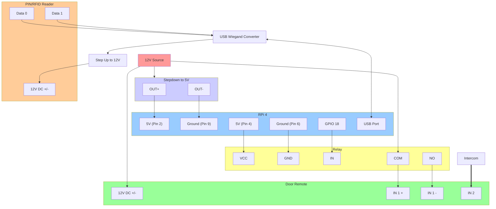

# door-pin

Simple door lock system with PIN codes, RFID tags and remote unlocking using Raspberry PI.

You can find the client web app under [door-control-web-app](https://github.com/jonasjancarik/door-control-web-app).

## Hardware

Tested on Raspberry PI 4 and 5. On Raspberry PI 3, you will have trouble installing the required packages (in particular rpi-gpio) with Python 3.11. The code contains some async stuff that won't work on Python 3.9 (which is the default on Raspberry PI 3) and rpi.gpio won't run on Python 3.11 on Raspberry PI 3 (`version `GLIBC_2.34' not found`).

This will work with any relay operated lock that you can control from the GPIO pins of a Raspberry PI. You have to set up wiring so that the PI sends a door unlocking signal by activating a relay on a 12-24 V circuit connected to the I/O module. Tested with the I/O Module from SÜDMETALL (https://www.suedmetall.com/products/locking-systems/stand-alone-solutions/i-o-modul/?lang=en).

By default, the code expects the relay to be connected to GPIO pin 18, but this can be changed by setting the `RELAY_PIN` environment variable.

As for the PIN/RFID reader, the code is prepared to take normal "keyboard" input (evdev) - some USB-connected readers work like that. In development, you'll probably want to use terminal input, so set INPUT_SOURCE to terminal.

There is also a special mode called T9EM - I need to add more details on that but it's basically for a specific combination of the Asia-Teco "T9" Wiegand reader (http://www.asia-teco.com/en/h-por-j-262-5_262.html) which I got from Aliexpress (https://www.aliexpress.com/item/1005006244356261.html?spm=a2g0o.order_detail.order_detail_item.3.21fef19cNaLXvx) and a specific Wiegand to USB converter. You can select it by setting the INPUT_SOURCE environment variable to T9 (or T9EM - need to check.)

### Wiring

See the wiring I am using with a Wiegand reader and a Wiegand to USB converter below. You could also connect the 12V source directly to the PIN/card rearder, which might help prevent undervoltage on the RPi.



## Install

```bash
python -m venv .venv
. .venv/bin/activate
pip install --upgrade pip
pip install -r requirements.txt
```

If you encounter an error installing `evdev`, try installing the `python3-evdev` package with `sudo apt-get install python3-evdev`. In that case you may want to create the virtual environment with the `--system-site-packages` flag (i.e. `python -m venv .venv --system-site-packages`) and ignore the `evdev` package in the `requirements.txt` file with `grep -v "evdev" requirements.txt | pip install -r /dev/stdin`.

If you want to get the latest versions of all the required packages, you can try running `pip install fastapi sqlalchemy boto3 python-dotenv uvicorn "pydantic[email]" rpi-lgpio evdev` directly.

### Development

For development on a machine which doesn't support `RPi.GPIO` and `evdev`, run just `pip install fastapi sqlalchemy boto3 python-dotenv uvicorn "pydantic[email]"` to exclude these packages.

Then run the setup script to create a dummy `RPi` package:

```bash
./setup_mock_rpi_gpio.sh
```

## Networking

Because this will be running on a Raspberry PI - likely without a static public IP address or port forwarding, you will need a way of opening it up to recieve HTTP requests. There are multiple ways: traditionally you'd use port forwarding to another server exposed to the Internet, or you can use a service like Cloudflare Tunnels instead.

### Option 1: Cloudflare tunnel

Cloudflare Tunnels provide a secure way to expose your Raspberry PI to the internet without opening ports on your router or having a static IP address. This is the recommended approach as it's more secure and easier to set up than traditional port forwarding.

#### Prerequisites

1. A Cloudflare account (free tier works fine)
2. A domain name managed by Cloudflare
3. Your Raspberry PI connected to the internet

#### Setup Steps

1. **Install cloudflared on your Raspberry PI:**

   ```bash
   # Download the latest cloudflared for ARM64 (RPi 4/5) or ARM (RPi 3)
   # For RPi 4/5 (ARM64):
   wget https://github.com/cloudflare/cloudflared/releases/latest/download/cloudflared-linux-arm64
   sudo mv cloudflared-linux-arm64 /usr/local/bin/cloudflared
   sudo chmod +x /usr/local/bin/cloudflared
   
   # For RPi 3 (ARM):
   # wget https://github.com/cloudflare/cloudflared/releases/latest/download/cloudflared-linux-arm
   # sudo mv cloudflared-linux-arm /usr/local/bin/cloudflared
   # sudo chmod +x /usr/local/bin/cloudflared
   ```

2. **Authenticate cloudflared with your Cloudflare account:**

   ```bash
   cloudflared tunnel login
   ```

   This will open a browser window where you need to select your domain and authorize the tunnel.

3. **Create a tunnel:**

   ```bash
   cloudflared tunnel create door-pin
   ```

   This creates a tunnel and generates a tunnel ID. Note down the tunnel ID for later use.

4. **Create a configuration file:**

   Create `/home/pi/.cloudflared/config.yml` (replace `<TUNNEL_ID>` with your actual tunnel ID):

   ```yaml
   tunnel: <TUNNEL_ID>
   credentials-file: /home/pi/.cloudflared/<TUNNEL_ID>.json
   
   ingress:
     - hostname: door.yourdomain.com
       service: http://localhost:8000
     - service: http_status:404
   ```

5. **Create a DNS record:**

   ```bash
   cloudflared tunnel route dns door-pin door.yourdomain.com
   ```

   Replace `door.yourdomain.com` with your desired subdomain.

6. **Test the tunnel:**

   Start your door-pin API server:
   ```bash
   uvicorn api:app --host 0.0.0.0 --port 8000
   ```

   In another terminal, start the tunnel:
   ```bash
   cloudflared tunnel run door-pin
   ```

   Your API should now be accessible at `https://door.yourdomain.com`

7. **Set up as a system service (optional but recommended):**

   Create a systemd service file at `/etc/systemd/system/cloudflared.service`:

   ```ini
   [Unit]
   Description=Cloudflare Tunnel
   After=network.target
   
   [Service]
   Type=simple
   User=pi
   ExecStart=/usr/local/bin/cloudflared tunnel run door-pin
   Restart=always
   RestartSec=5
   KillMode=mixed
   
   [Install]
   WantedBy=multi-user.target
   ```

   Enable and start the service:
   ```bash
   sudo systemctl enable cloudflared
   sudo systemctl start cloudflared
   ```

#### Security Considerations

- Your tunnel is automatically secured with TLS
- Consider adding Cloudflare Access rules to restrict who can access your door control system
- You can add additional authentication layers through Cloudflare's security features
- Monitor access logs through the Cloudflare dashboard

### Option 2: Use another server as a proxy to forward requests to the Raspberry PI.

On the Raspberry PI, set up reverse port forwarding like this:

```bash
ssh -R 8000:localhost:8000 <server>
```

Or use autossh to keep the connection alive, for example:

```bash
autossh -M 20000 -N -R 8000:localhost:8000 username@proxy-server -o "ServerAliveInterval 30" -o "ServerAliveCountMax 3"
```

You can even set it up as a systemd service to run in the background like this:

```bash
[Unit]
Description=AutoSSH tunnel service for port 4444
After=network.target

[Service]
User=pi
Group=pi
ExecStart=/usr/bin/autossh -M 20000 -N -R 8000:localhost:8000 username@proxy-server -o "ServerAliveInterval 30" -o "ServerAliveCountMax 3"
Restart=always
RestartSec=3
StartLimitIntervalSec=60
StartLimitBurst=10

[Install]
WantedBy=multi-user.target
```

## Usage

### First-time setup

Set environment variables to configure the app. First copy the example file with `cp .env.example .env` and then edit as needed.

Run `python setup.py` to create the database and set up the first user. You can also use a CSV file with usernames and PIN codes to create multiple users at once - use the `users.csv.example` as a template.

### Launching the API server

Launch the API server with `uvicorn api:app` (or with the `--reload` flag for development). 

You need to obtain a bearer token first to use the API directly - you can do it through the web app and extracting the bearer token from the `Authorization` header of the requests. There is functionality for proper API keys in the API, but it is not tested and implemented in the frontend client app yet.
